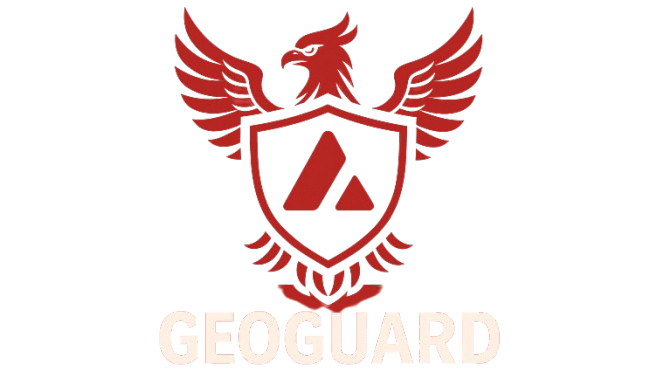

# GeoGuard

<div align="center">
  
</div>

GeoGuard is a decentralized platform for managing geographically-distributed validators on the Avalanche network. The platform enables users to mint validator tokens, lookup node IDs, and add validators to their subnet.

## Features

### Main Interface

- **Global Coverage**: Displays worldwide validator presence with flags from USA, EU, India, China, and Russia
- **Token Management**: Mint new tokens with node IDs and lookup existing node IDs
- **Validator Management**: Add and manage validators for your subnet

### Contract Interactions

- **Mint Tokens**: Create new tokens with specified recipient address, token ID, and node ID
- **Node ID Lookup**: Query node IDs associated with specific tokens and accounts
- **Validator Registration**: Complete process for adding validators to subnets

## Pages and Components

### Home Page
- Global coverage display with country flags
- Quick access buttons for all main features:
  - Mint Token (Modal)
  - Lookup Node ID (Modal) 
  - Add Validator (Page)

### Validator Manager Page
- Complete validator registration flow
- Tools for managing subnet validators
- Connects with Core wallet for transaction signing

### Modals
- **Mint Modal**: Interface for minting new tokens with:
  - Recipient address field (with "Use My Address" option)
  - Optional token ID field
  - Node ID field
  - Success/error notifications via tooltips

- **Lookup Modal**: Interface for looking up node IDs with:
  - Token ID field
  - Account address field (with "Use My Address" option)
  - Results display
  - Error notifications via tooltips

## Recent Updates

### UI Improvements
- **Header Layout**: 
  - Centered GeoGuard banner
  - Logo links to homepage
  - Improved wallet display with clear separation between balance and address

- **Modal Interface**: 
  - Replaced page-based interaction with modals for token operations
  - Added tooltips for success/error notifications
  - Improved input validation and feedback

- **Navigation**:
  - Added validator management page
  - Streamlined contract interaction workflow
  - Enhanced mobile responsiveness

## Smart Contract Integration

GeoGuard integrates with the following smart contract functions:

```solidity
// Mint a new token with a node ID
function mint(address to, uint256 tokenId, string memory nodeId) external;

// Get the node ID for a specific token
function getNodeId(uint256 tokenId, address account) external view returns (string memory);

// Get the last token ID
function lastTokenId() external view returns (uint256);
```

## Technologies Used

- **Frontend**: Next.js, React, TypeScript, Tailwind CSS
- **Blockchain**: Avalanche, ethers.js v6
- **UI Components**: Radix UI, Lucide Icons

## Setup and Development

### Prerequisites
- Node.js 18+
- Yarn

### Installation

1. Clone the repository
```bash
git clone https://github.com/your-username/geoguard.git
cd geoguard
```

2. Install dependencies
```bash
yarn install
```

3. Start the development server
```bash
yarn dev
```

4. Open [http://localhost:3000](http://localhost:3000) to view the application

## Production Build

```bash
yarn build
yarn start
```

## License

[MIT](LICENSE)
